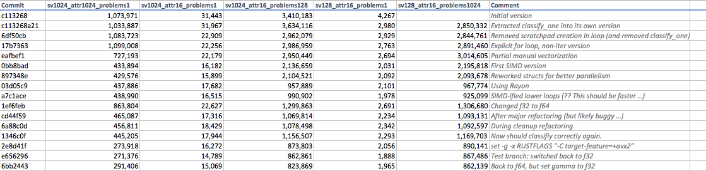

# Overview

`ffsvm-rust` is

* optimized for SIMD and parallelism
* allocation-free during classification
* classification-only
* but can load trained [libsvm](https://github.com/cjlin1/libsvm) **RBF C-SVM** models (without sparse parameters)

# Performance History

Numbers reported by `cargo bench` as *nanoseconds per iter*. In other words, on my machine (MBP 2015 i7), classifiying a given problem takes the time shown.

I keep these numbers mostly to track my own progress over time while playing with different Rust concepts (e.g., [Rayon](https://github.com/rayon-rs/rayon) or [Faster](https://github.com/AdamNiederer/faster)).

# FAQ

These FAQs are mostly for myself.

#### How do I enable AVX2 support?

If using the Fish shell run:

`set -g -x RUSTFLAGS "-C target-feature=+avx2"`

Also make sure to modify `utils.rs` and set `SIMD_F32_WIDTH` and `SIMD_F64_WIDTH`.

# Questions & TODO                                               

#### Performance

 * Is going full `f32` worth it, and what about classification accuracy?

#### Building

 * How to better enable `avx2` from Cargo without resorting to `RUSTFLAGS`?

#### Idiomatic Rust

 * Implement [common traits](https://doc.rust-lang.org/1.0.0/style/features/traits/common.html).
 * How should I name number variables consistently? `num_vectors`? `vectors`? `n_vectors`?   
 * How to name constructors that take multiple arguments? `with_a_b_c`, `with_something`, `with`?
 * How to implement common method for `Vec<T>` and `&[T]`?   

#### SIMD / Faster

 * How to sum a f32s to a single scalar with [faster](https://github.com/AdamNiederer/faster)?
 * How to get rid of [itertools](https://github.com/bluss/rust-itertools) `zip` with [faster](https://github.com/AdamNiederer/faster)?
 * How to get rid of `SIMD_F32_WIDTH`?
