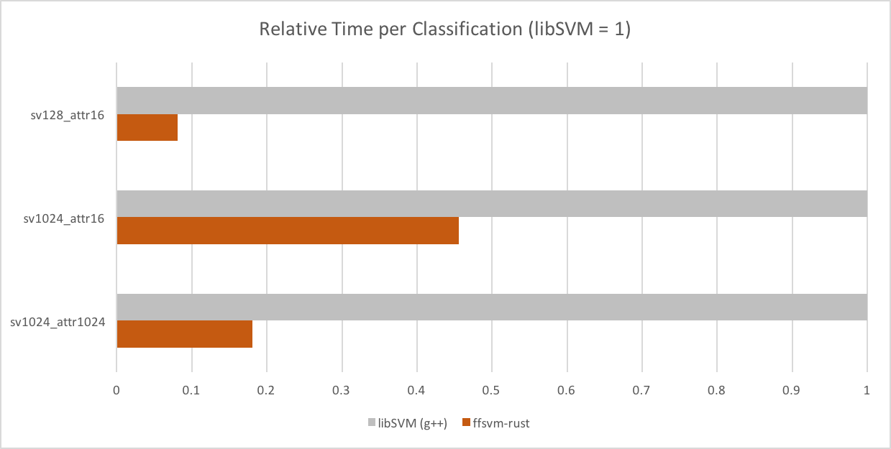
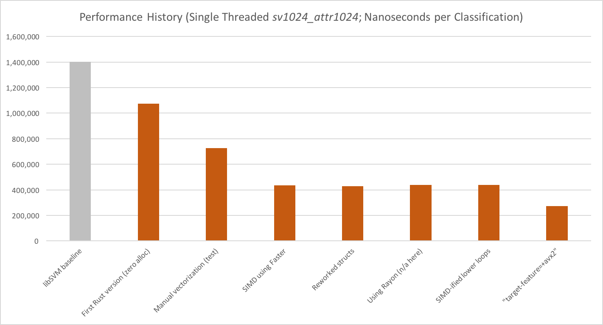

# In One Sentence

You trained a binary non-sparse RBF-C-SVM using [libSVM](https://github.com/cjlin1/libsvm), now you want the highest possible performance during (real-time) classification, like games or VR.


# Highlights

* can load trained [libSVM](https://github.com/cjlin1/libsvm) models (currently binary RBF-CSVM without sparse attributes)
* optimized for SIMD and can be mixed seamlessly with [Rayon](https://github.com/rayon-rs/rayon).
* allocation-free during classification
* written in 100% Rust, but can be loaded from any language (via FFI)
* 2.5x - 14x faster than libSVM


# Principal Usage

Train with [libSVM](https://github.com/cjlin1/libsvm) (e.g., using the tool `svm-train`), then classify with `ffsvm-rust`.

From Rust:

```rust
// Get your libSVM model string from wherever and parse it.
let model_str: &str = include_str!("model.libsvm");
let model = ModelFile::try_from(model_str).unwrap();

// Produce actual SVM from raw model, and a problem
let csvm = RbfCSVM::try_from(&model).unwrap();
let mut problem = Problem::from(&csvm);

// Set the features of this problem we want to classify.
problem.features = vec![ 0.3093766, 0.0, 0.0, 0.0, 0.0, 0.1764706, 0.1137485 ];

// (We also have methods to classify multiple in parallel w. Rayon ...)
csvm.predict_value(&mut problem);

// Results should match libSVM
assert_eq!(0, problem.label);
```

From C / FFI:

Please see [FFSVM-FFI](https://github.com/ralfbiedert/ffsvm-ffi)


# Status

* **Aug 5, 2018**: Still in alpha, but finally on crates.io.
* **May 27, 2018**: We're in alpha. Successfully used internally on Windows, Mac, Android and Linux
on various machines and devices. Once SIMD stabilizes and we can cross-compile to WASM
we'll move to beta.
* **December 16, 2017**: We're in pre-alpha. It will probably not even work on your machine.


# Performance



Classification time vs. libSVM.



Performance milestones during development.

[See here for details.](https://github.com/ralfbiedert/ffsvm-rust/blob/master/docs/performance.adoc)


# FAQ

[See here for details.](https://github.com/ralfbiedert/ffsvm-rust/blob/master/docs/FAQ.adoc)
