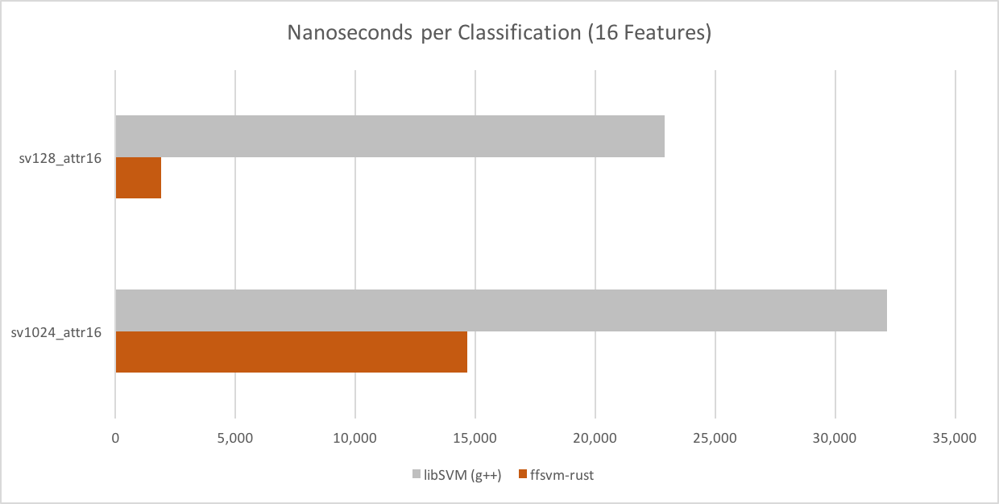

= Performance vs. LibSVM

Benchmarks are a tricky thing, but for classifying binary non-sparse RBF-C-SVMs `ffsvm` should be between 2.5x and 14x faster than `libSVM` on reasonably modern x86 CPUs (supporting AVX2).

image::performance_relative.v3.png[]

(See _Benchmark Notes_ below)

There are 3 major factors contributing to this:

* no allocation during classification
* cache-friendly memory layout
* usage of SIMD / AVX

*In addition* to the speed up presented above, ffsvm also has an API for _batch classification_, that transparently makes use of all available CPU cores, *possibly providing even higher speed ups* if you classify more than one problem at a time.

=== LibSVM Design

LibSVM is a general purpose SVM library, that supports various kernels, modes and sparse (non-sequential) attributes.

Due to it's flexibility, however, a number of performance problems become apparent:

For small problems (e.g., `sv128_attr16`), libSVM spends _lots_ of time allocating / freeing memory all over the place.

For problems with many feature vectors (e.g., `sv1024_attr1024`), it spends a large fraction of it's time checking indices, effectively preventing stream processing.

For problems with many _problems_ (tasks to classify), it does not make use of threading.

=== FFSVM Design

In contrast to LibSVM, ffsvm focuses on one thing: classifying "bread-and-butter" dense binary RBF-C-SVMs.

It provides no tools for learning, but is able to load compatible libSVM models.

Once loaded, the models and classification problems are stored in cache-, SIMD- and threading-optimized data-structures.

It then mostly relies on https://github.com/rayon-rs/rayon[Rayon] and https://github.com/AdamNiederer/faster[Faster], on top of which it implements its RBF-C-SVM logic.

FFSVM has been, from day one, optimized for performance:

= Performance History

image::performance_history.v3.png[]

Some of the more significant performance milestones in ffsvm's development.

= History Details

Numbers reported by `cargo bench` as *nanoseconds per iter*. In other words, on my machine (MBP'15 i7), classifiying a given problem takes the time shown.

image::https://i.imgur.com/bvOR8d4.png[]

I keep these numbers mostly to track my own progress over time while playing with different Rust concepts (e.g., https://github.com/rayon-rs/rayon[Rayon] or https://github.com/AdamNiederer/faster[Faster]).

= Benchmark Notes

Numbers measured on MBP'15 i7, manually ensuring no background activity took place.

LibSVM 3.22 compiled with `g++ -O3 -fPIC` (as enabled in original `Makefile`). Timings measured with `gettimeofday()` around the `svm_predict_probability()` function inside patched `svm-predict`, classifying the same problem 1k - 100k times (after 1k cache warmup rounds), and taking the average.

FFSVM compiled with `target-feature=+avx2`. Timings measured with `#[bench]` (see code).

All benchmarks run on synthetic binary models / data as specified (e.g., `sv16_attr4` means a total of 16 support vectors and 4 attributes / features).

Lower is better.
