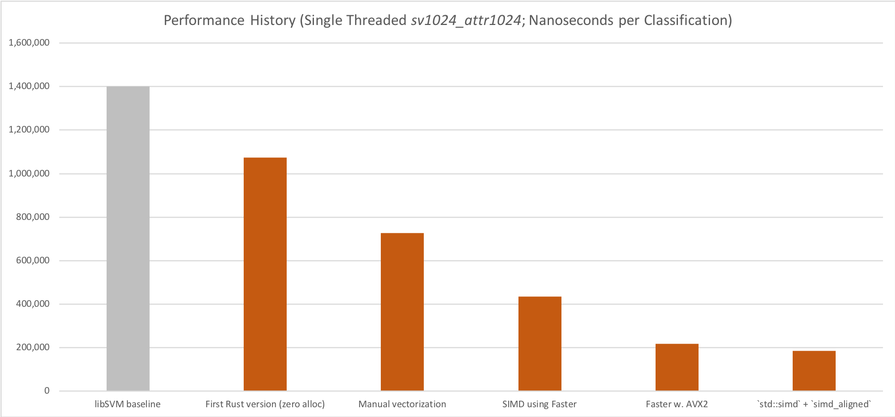
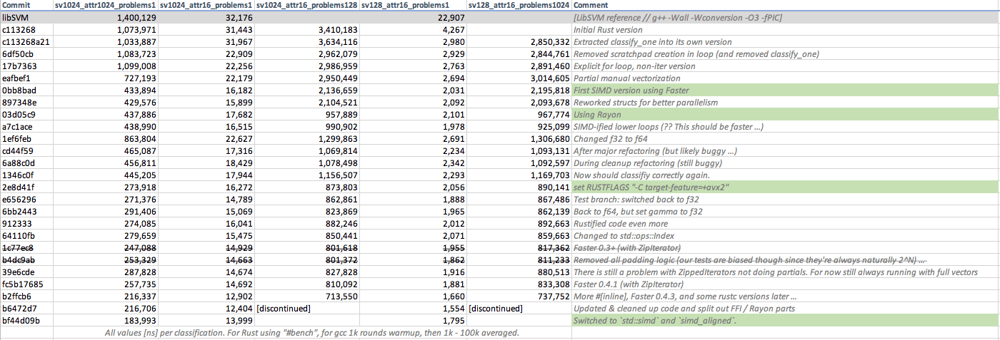

# Performance vs. LibSVM

Benchmarks are a tricky thing, but for classifying dense RBF-C-SVMs `ffsvm` should be between 2.5x and 14x faster than `libSVM` on reasonably modern x86 CPUs (supporting AVX2).


(See _Benchmark Notes_ below)

There are 3 major factors contributing to this:

* no allocation during classification
* cache-friendly memory layout
* usage of SIMD / AVX

In addition, ffsvm mixes seamlessly with Rayon for _batch classification_, providing even higher speed ups if you classify more than one problem at a time.


# Performance History



Some of the more significant performance milestones in ffsvm's development.


# Current Benchmarks

As of August 2018, the current benchmark numbers on my reference machine are listed below. For reference, the `libSVM` benchmarks are roughly `1.400.000` (rbf_sv1024_attr1024), `32.000` (rbf_sv1024_attr16) and `22.000` (rbf_sv128_attr16).

```
     Running target/release/deps/svm_dense-f9ea67c2ad278568

running 12 tests
test svm_dense::predict_linear_sv1024_attr1024  ... bench:     198,561 ns/iter (+/- 54,931)
test svm_dense::predict_linear_sv1024_attr16    ... bench:       3,936 ns/iter (+/- 378)
test svm_dense::predict_linear_sv128_attr16     ... bench:         468 ns/iter (+/- 25)
test svm_dense::predict_poly_sv1024_attr1024    ... bench:     190,109 ns/iter (+/- 28,901)
test svm_dense::predict_poly_sv1024_attr16      ... bench:       6,101 ns/iter (+/- 880)
test svm_dense::predict_poly_sv128_attr16       ... bench:         710 ns/iter (+/- 10)
test svm_dense::predict_rbf_sv1024_attr1024     ... bench:     205,959 ns/iter (+/- 74,250)
test svm_dense::predict_rbf_sv1024_attr16       ... bench:       6,679 ns/iter (+/- 1,002)
test svm_dense::predict_rbf_sv128_attr16        ... bench:         887 ns/iter (+/- 42)
test svm_dense::predict_sigmoid_sv1024_attr1024 ... bench:     191,243 ns/iter (+/- 44,552)
test svm_dense::predict_sigmoid_sv1024_attr16   ... bench:       8,013 ns/iter (+/- 610)
test svm_dense::predict_sigmoid_sv128_attr16    ... bench:       1,430 ns/iter (+/- 81)

test result: ok. 0 passed; 0 failed; 0 ignored; 12 measured; 0 filtered out

     Running target/release/deps/svm_sparse-1f71e6cc512cd165

running 12 tests
test svm_sparse::predict_linear_sv1024_attr1024  ... bench:   1,615,040 ns/iter (+/- 135,666)
test svm_sparse::predict_linear_sv1024_attr16    ... bench:      25,710 ns/iter (+/- 649)
test svm_sparse::predict_linear_sv128_attr16     ... bench:       3,261 ns/iter (+/- 148)
test svm_sparse::predict_poly_sv1024_attr1024    ... bench:   1,608,263 ns/iter (+/- 105,118)
test svm_sparse::predict_poly_sv1024_attr16      ... bench:      28,228 ns/iter (+/- 2,190)
test svm_sparse::predict_poly_sv128_attr16       ... bench:       3,574 ns/iter (+/- 110)
test svm_sparse::predict_rbf_sv1024_attr1024     ... bench:   1,581,233 ns/iter (+/- 100,222)
test svm_sparse::predict_rbf_sv1024_attr16       ... bench:      28,165 ns/iter (+/- 915)
test svm_sparse::predict_rbf_sv128_attr16        ... bench:       3,573 ns/iter (+/- 279)
test svm_sparse::predict_sigmoid_sv1024_attr1024 ... bench:   1,594,867 ns/iter (+/- 103,954)
test svm_sparse::predict_sigmoid_sv1024_attr16   ... bench:      30,903 ns/iter (+/- 879)
test svm_sparse::predict_sigmoid_sv128_attr16    ... bench:       3,564 ns/iter (+/- 131)

test result: ok. 0 passed; 0 failed; 0 ignored; 12 measured; 0 filtered out

```


# History Details

Numbers reported by `cargo bench` as *nanoseconds per iter*. In other words, on my machine (MBP'15 i7), classifiying a given problem takes the time shown.



I keep these numbers mostly to track my own progress over time while playing with different Rust concepts (e.g., [Rayon](https://github.com/rayon-rs/rayon), [Faster](https://github.com/AdamNiederer/faster), or [packed_simd](https://github.com/rust-lang-nursery/packed_simd)).

Note, as of August 2018 (last entry on the list), these numbers are not fully comparable anymore, since our benchmarking procedure slightly changed.


# Benchmark Notes

Numbers measured on MBP'15 i7, manually ensuring no background activity took place.

LibSVM 3.22 compiled with `g++ -O3 -fPIC` (as enabled in original `Makefile`). Timings measured with `gettimeofday()` around the `svm_predict_probability()` function inside patched `svm-predict`, classifying the same problem 1k - 100k times (after 1k cache warmup rounds), and taking the average.

FFSVM compiled with `target-feature=+avx2`. Timings measured with `#[bench]` (see code).

All benchmarks run on synthetic binary models / data as specified (e.g., `sv16_attr4` means a total of 16 support vectors and 4 attributes / features).

Lower is better.
